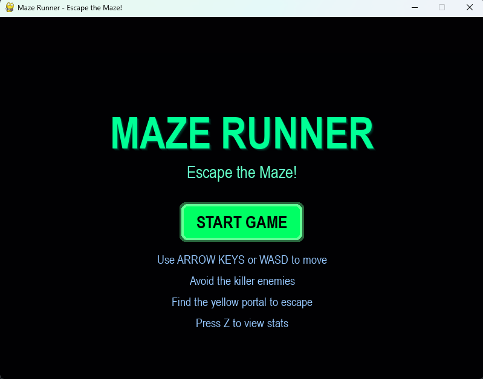
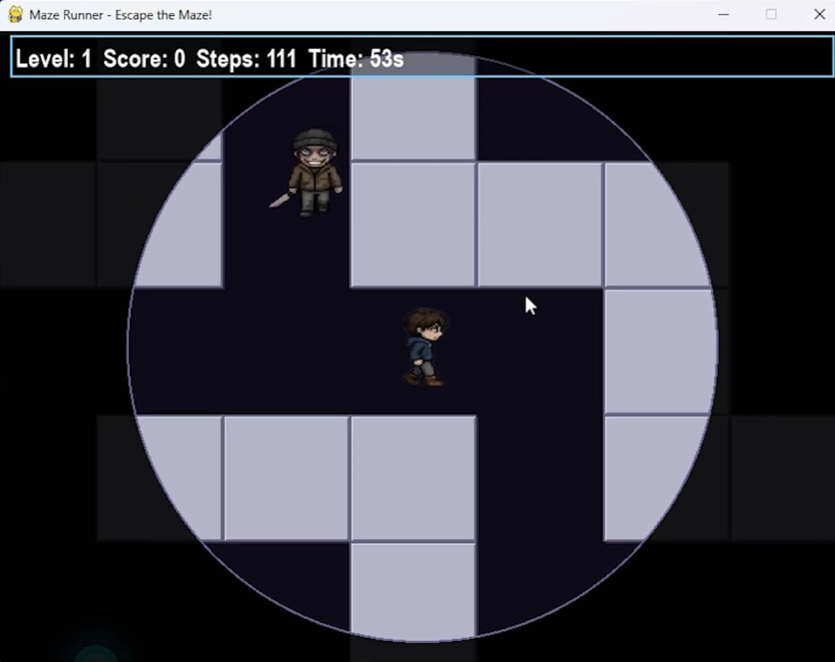
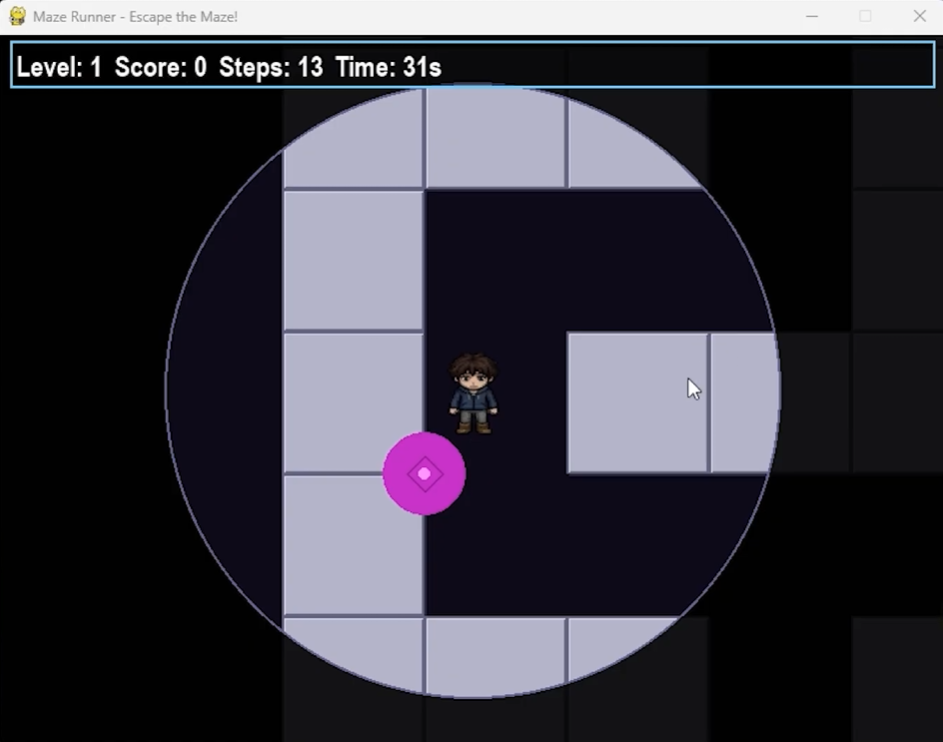
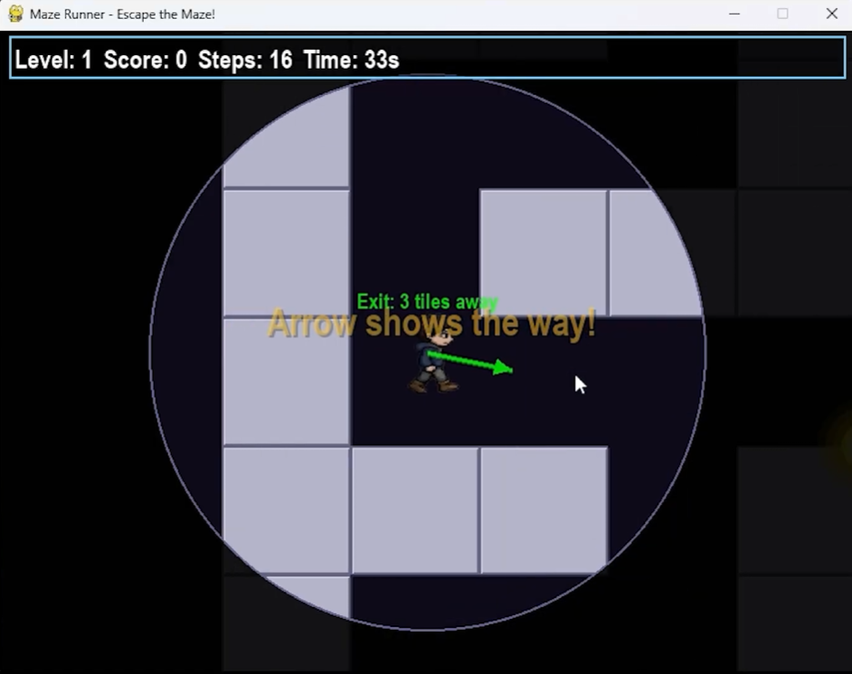
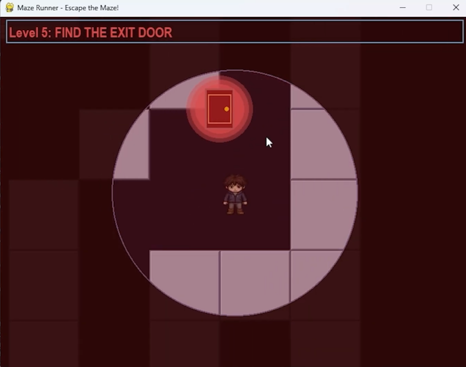
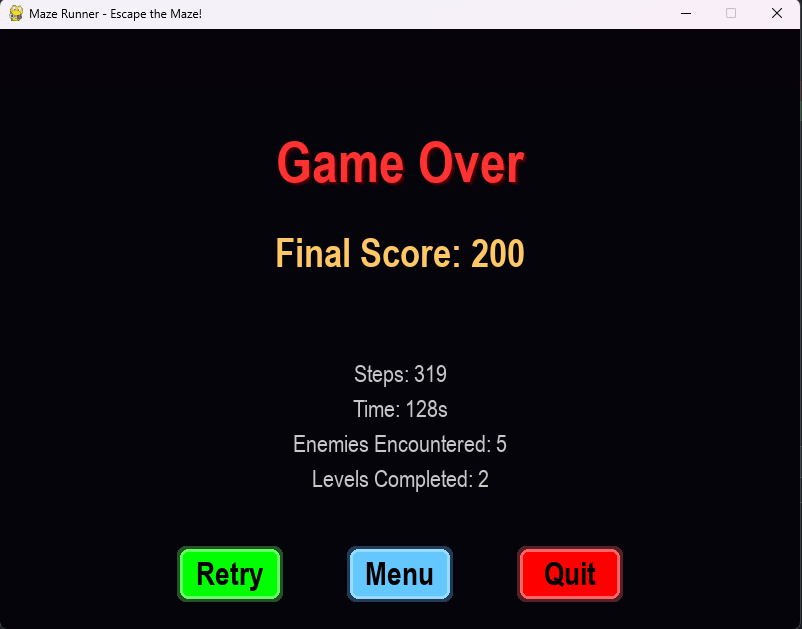
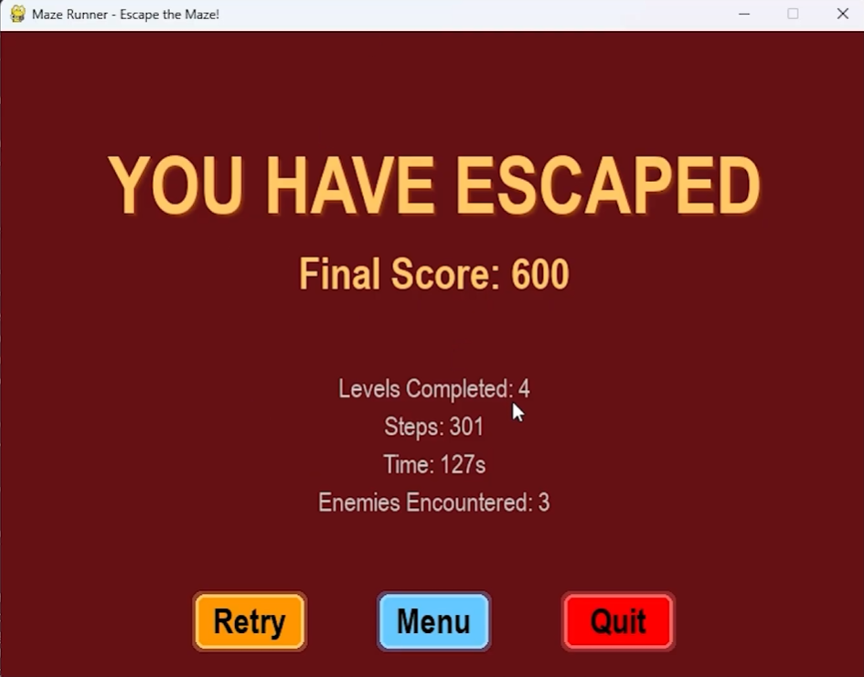

# Project Description

## 1. Project Overview

### **Project Name:**
Horror Maze Escape

### **Brief Description:**
Horror Maze Escape is a 2D horror-style maze escape game where players navigate through procedurally generated mazes while avoiding intelligent enemies. The game features progressive difficulty levels, collectible hint items, teleportation portals, and a comprehensive statistics system. Players must find the escape portal on each level to progress, with the ultimate goal of reaching level 5 and escaping the final maze.

### **Problem Statement:**
This project aims to create an engaging maze-based game that combines exploration, strategy, and survival mechanics. Players face the challenge of navigating complex mazes while avoiding enemy encounters, managing limited visibility, and collecting hint items to guide their escape route.

### **Target Users:**
- Casual gamers who loves puzzle and exploration challenges
- Indie game enthusiasts
- Players interested in maze-based gameplay
- Users who enjoy progressive difficulty systems and statistics tracking

### **Key Features:**
- **Procedurally Generated Mazes:** Unique maze layouts on each level using depth-first search algorithm
- **Enemy AI:** Multiple enemies with chase mechanics using pathfinding algorithm and detection ranges
- **Progressive Difficulty:** Increasing enemy count, vision limitations  and decreasing the number of portal and hint items as levels advance
- **Fog of War:** Dynamic visibility system that limits player sight range
- **Teleportation Portals:** Random portals that teleport players to different maze locations
- **Hint Items:** Collectible items that reveal the direction to the escape door
- **Multi-Level System:** 5 progressively challenging levels with unique visual themes
- **Statistics Tracking:** Comprehensive game statistics including steps, time, enemies encountered, score, completed levels and result
- **Visual Effects:** Screen shake, floating text, glowing effects, and particle animations
- **Sound Effects:** Heartbeat, teleport, and game-over audio cues
- **Menu System:** Main menu, game-over screen, and stats visualization

### **Screenshots:**
**Gameplay:**

**Data Visualization:**

### **Proposal:**
**Attachment:** [Proposal](Proposal.pdf)

### **YouTube Presentation:**
**Attachment:** https://youtu.be/CrqFzwUMkhc?si=g75Fb2KiKWFGdtri

---

## 2. Concept

### **2.1 Background:**
Maze escape games have been a staple of gaming for decades, from early text-based adventures to modern procedurally generated roguelikes. This game combine the classic maze game mechanic with modern game design inspiring by j-indie horror game and rougelike vibe.  

### **2.2 Objectives:**
- **Clear goals of the system:**
  - Create a fully functional, playable maze-based game
  - Implement intelligent enemy AI with varying detection and chasing behaviors
  - Develop a procedurally generated maze system that ensures playability
  - Implement a comprehensive statistics and tracking system
  - Create a scalable level system with progressive difficulty

- **What you want to achieve:**
  - Demonstrate competency in object-oriented design and implementation
  - Create an engaging user experience through visual and audio feedback
  - Implement data persistence and analytics for game statistics
  - Build a modular, maintainable codebase that can be extended with new features

---

## 3. UML Class Diagram

**Attachment:** [UML Class Diagram](UML_diagram.pdf)

---

## 4. Object-Oriented Programming Implementation

### **Classes Implemented:**

**`Player`**
- Represents the player character that the user controls
- Manages position, direction, movement, and animation frames
- Handles sprite loading for directional animations
- Role: Core gameplay entity controlled by player input

**`Enemy`**
- Represents AI-controlled enemies that pursue the player
- Implements chase logic with distance-based detection
- Manages autonomous movement and collision detection
- Role: Primary obstacle creating challenge and tension

**`Maze`**
- Generates procedurally unique maze layouts using recursive backtracking
- Stores walkable and wall tiles
- Manages maze rendering with visual enhancements
- Role: Core game environment and navigation challenge

**`Portal`**
- Represents both teleportation portals and escape doors
- Handles collision detection and player teleportation
- Implements visual effects like pulsing glow
- Role: Level progression mechanism and strategic gameplay elements

**`Camera`**
- Manages viewport positioning centered on the player
- Converts world coordinates to screen coordinates
- Enables camera panning and world boundaries
- Role: View management and rendering coordination

**`HintItem`**
- Represents collectible hint items in the maze
- Provides directional guidance to the escape portal
- Tracks collection state and implements visual feedback
- Role: Optional strategic aid for player navigation

**`StatsManager`**
- Records all game statistics in CSV format
- Tracks steps, time, enemies encountered, score, and outcome
- Persists data for long-term analytics
- Role: Data recording and retrieval

**`StatsVisualizer`**
- Displays game statistics through charts and graphs
- Renders performance metrics and visual analytics
- Implements interactive statistics screen
- Role: Data presentation and player feedback

**`Visual Effects Classes`**
- `GlowEffect`: Pulsing alpha animation for portals
- `ScreenShake`: Camera vibration during tense moments
- `FloatingTextManager`: On-screen text notifications and scores
- `ArrowEffect`: Directional indicator pointing to escape door
- Role: Visual feedback and game atmosphere enhancement

---

## 5. Statistical Data

### **5.1 Data Recording Method:**

Game statistics are recorded after each game session in `game_stats.csv`. The StatsManager class handles all data persistence using Python's CSV module. Each game session records:

- **Game_ID:** Number of game that being play
- **Result:** Win or Loss
- **Steps:** Total tiles traversed
- **Time:** Duration in seconds
- **Enemies Encountered:** Number of unique enemies detected
- **Score:** Final score earned
- **Levels Completed:** Number of levels progressed through

The data is appended to the CSV file, creating a chronological history of all gameplay sessions for trend analysis and performance tracking.

### **5.2 Data Features:**

**Recorded Metrics:**
- **Steps Count:** Measures player efficiency in navigation
- **Elapsed Time:** Tracks gameplay duration and speed
- **Enemy Encounters:** Indicates aggressive enemy encounters and player caution
- **Score:** Final performance rating based on achievements
- **Win/Loss Ratio:** Success rate across multiple games
- **Levels Completed:** Progression metric showing how far players advance

**Visualization Features:**
- Choosing between data: steps, time, enemies, score, result
- Choosing between bar or line graph for each data
- Statistics summary displaying averages, min and max
- Interactive statistics screen accessible during gameplay with 'Z' key or access at main menu using 'view stats' button

**Data Usage:**
- Analyze player progression patterns
- Identify difficult levels based on attempt data
- Track game balance through statistical metrics
- Provide feedback on player performance and improvement

---

## 6. Changed Proposed Features

### **Features Added Beyond Original Proposal:**
- **Main Menu Screen:** Dedicated menu with game instructions and START button
- **Game-Over Menu:** Return-to-menu option allowing players to restart or return home
- **Advanced Visual Effects:** Enhanced glow effects, screen shake, floating text, and particle systems
- **Arrow Hint System:** Visual directional indicator showing escape door location
- **Multi-Level Progression:** Extended from single level to 5-level progression system
- **Sound Integration:** Audio feedback for events (heartbeat, teleport, game-over, escape)
- **Fog of War System:** Dynamic visibility limiting with progressive difficulty
- **Entity Avatar System:** Sprite-based animations for player and enemies
- **Statistic Table:** Adding the amount of levels that the player have passed
- **Changing the data analysis report:** Not adding the correlation graph due to the change of winning result from escape that level count as a win to escape the level 5 to get a winning result. This make the amount of enemies not effect the winrate, so no correlation

---

## 7. External Sources

### **Sound:**
- Ambient music: https://youtu.be/xAO3x-Uhfoo?si=1sbyciBwffv3f9iG
- Heartbeat sound effect (Enemy nearby): https://youtu.be/TgZjYIPPe50?si=P78gjud7Oc195koT
- Screaming sound effect (Gameover): https://youtu.be/5fUAM0dR804?si=0O1P5jmFB9xEJzzL
- Teleport sound effect (Teleport portal): https://youtu.be/7ORuFBPthWQ?si=HDnBjlzZOHWQHVTL
- Escape portal sound effect (Escape portal): https://www.youtube.com/watch?v=rr5CMS2GtCY
---
- **Developer:** Techasit Suchatsunthon
