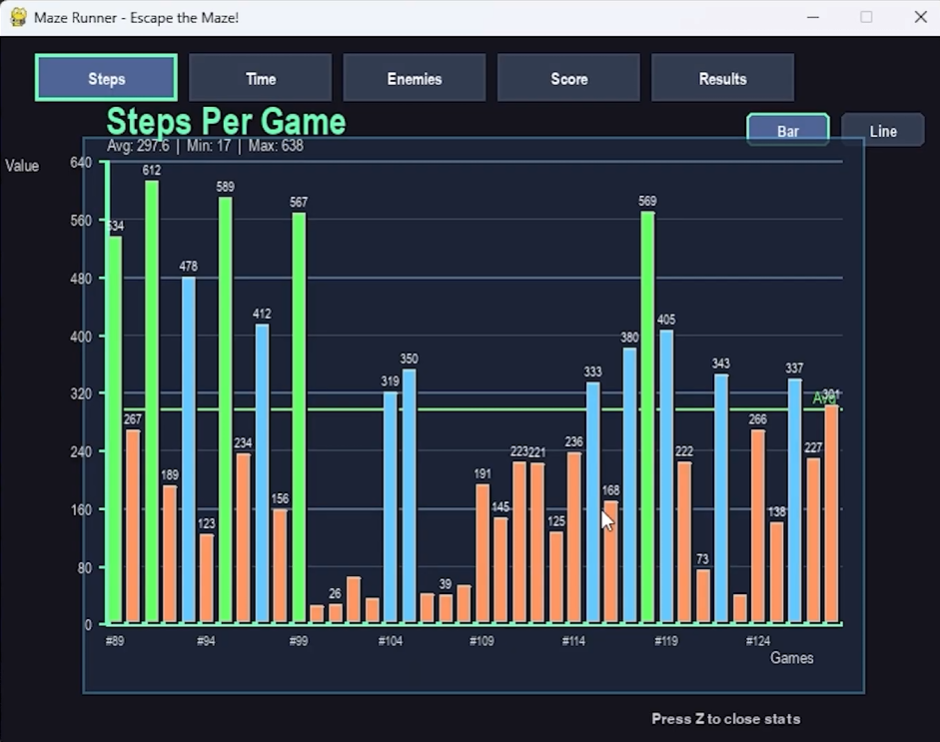
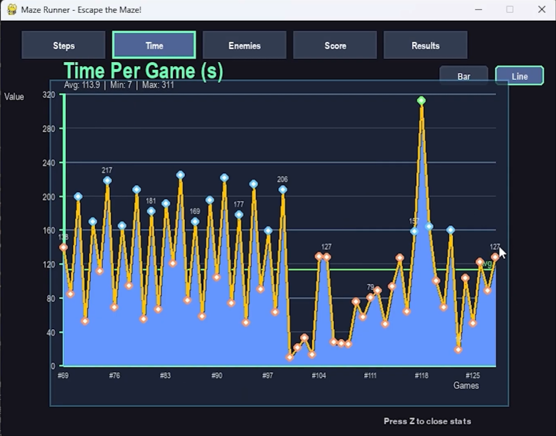
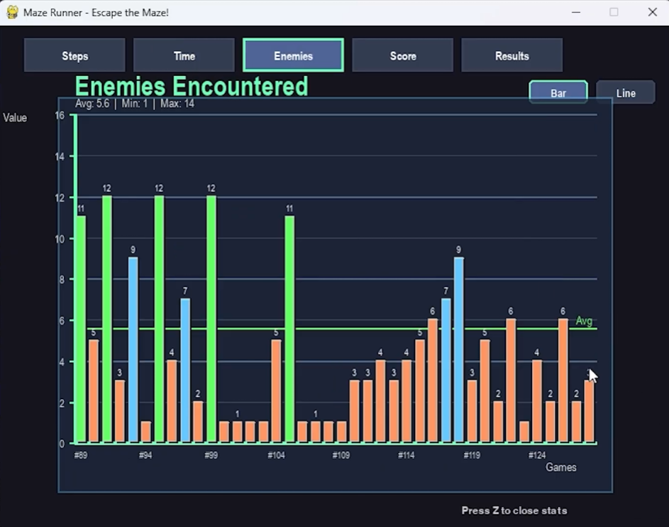
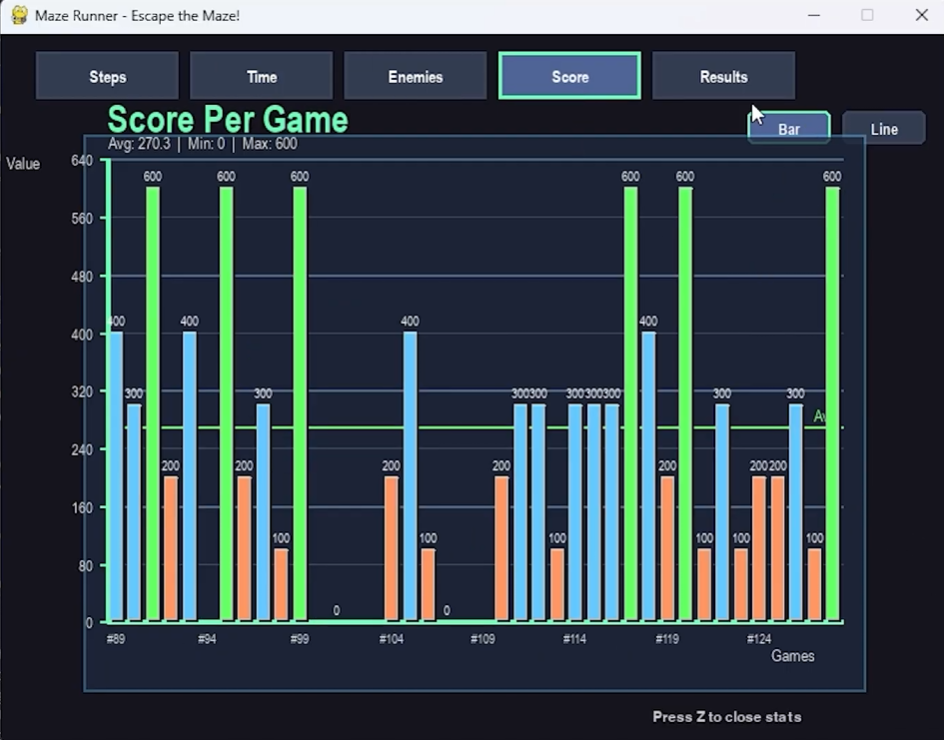
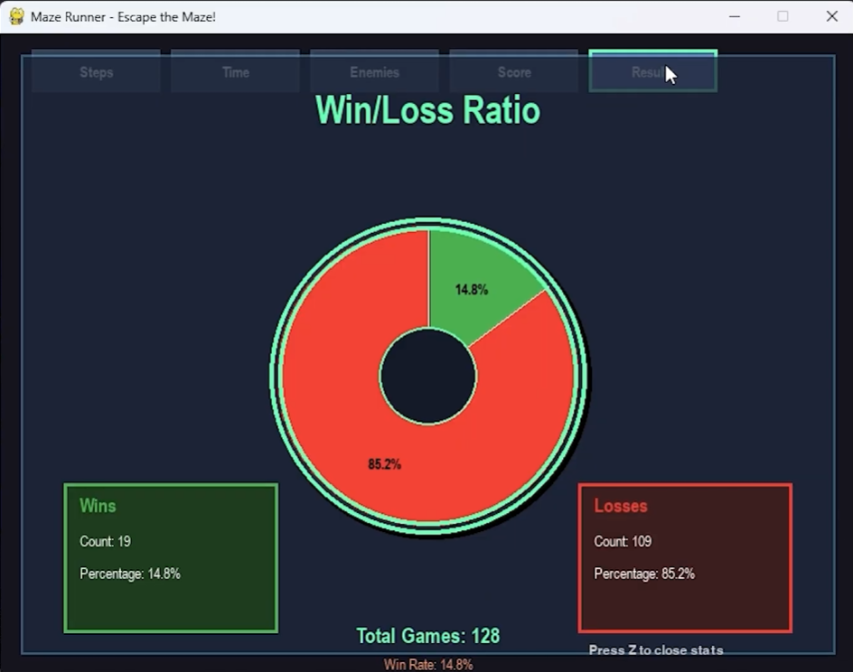

# Visualization Report

## Overview

This document presents the data visualization components developed for the Horror Maze Escape project.  
The visualizations are designed to help users understand gameplay performance, player statistics, and game progress through charts and tables.

---

# Component 1 — Steps Analysis

## Screenshot

## Explanation
This visualization displays the number of steps taken by the player during gameplay.  
The graph is useful for evaluating player efficiency in navigating the maze. Lower step counts generally indicate better pathfinding decisions and improved gameplay optimization.

---

# Component 2 — Time Analysis

## Screenshot

## Explanation
This graph presents the total time spent during gameplay sessions.  
The visualization allows users to analyze completion speed and compare performance across multiple attempts. Faster completion times may reflect increased familiarity with the maze structure and improved decision-making.

---

# Component 3 — Enemy Statistics

## Screenshot

## Explanation
This visualization shows statistics related to enemy interactions during gameplay.  
It provides insights into how enemy behavior affects player performance and game difficulty. The data can be used to evaluate balance and challenge levels within the game environment.

---

# Component 4 — Player Score Visualization

## Screenshot

## Explanation
This graph visualizes the player’s score performance throughout gameplay sessions.  
The visualization helps users compare scores between different game attempts and identify improvement trends over time. Higher scores indicate better maze completion performance and more efficient gameplay strategies.

---

# Result Summary Visualization

## Screenshot

## Explanation
This visualization summarizes the final gameplay results, overall player performance and indicate the difficulty of the game.  
The summary helps overview the improvements of the players and the adjustment of the overall difficulty of the game.

---

# Conclusion

The visualizations developed for Horror Maze Escape project provide meaningful insights into player behavior and gameplay performance.  
By presenting data through graphs and statistical summaries, the system improves user understanding of game progress and supports performance evaluation in an interactive and visually accessible manner.